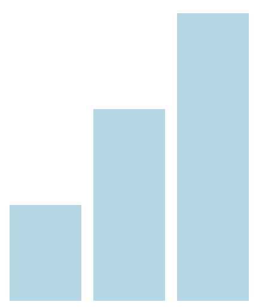
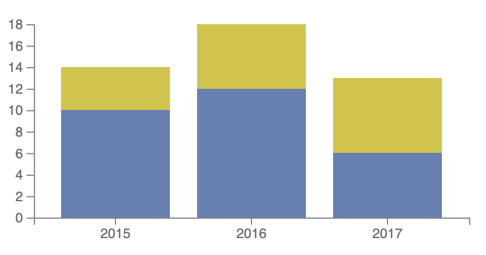

#### Welcome to my Data Visualization portfolio. Below is a link to my final project where a classmate and I mapped every Rubik's Cube European Competition from 1982 to 2021. Then, I showcase my labs for the course. As I learned more about JavaScript, CSS, and HTML, you can see my visualizations improved. 

  

    <a href="final/index.html">
      
      
Rubik's Cube Competitions

    </a>
  

  

    <a href="labs/lab1/index.html">
      
      
Global Attractions Attendance

    </a>
  

  

    <a href="labs/lab2/index.html">
      
      
Cities in the EU

    </a>
  

  

    <a href="labs/lab3/index.html">
      
      
Sales per Month Bar Chart

    </a>
  

  

    <a href="labs/lab4/activity1/activity1.html">
      
      
Coffee Shop Queue Simulation

    </a>
  

  

    <a href="labs/lab4/activity2/activity2.html">
      
      
Coffee House Chains

    </a>
  

  

    <a href="labs/lab5/activity1/transitions.html">
      
      
Transitions

    </a>
  

  

    <a href="labs/lab5/activity1/extra.html">
      
      
User Input

    </a>
  

  

    <a href="labs/lab5/activity2/tree.html">
      
      
Family Tree

    </a>
  

  

    <a href="labs/lab6/stock-skeleton/index.html">
      
      
S&P 500 Index

    </a>
  

  

    <a href="labs/lab6/stream-stacks/index.html">
      
      
Streams Stacked Bar Chart

    </a>
  

  

    <a href="labs/lab6/trails-skeleton/index.html">
      
      
Vancouver Trails

    </a>
  

  

    <a href="labs/lab7/index.html">
      
      
Variety of Visualizations

    </a>
  

